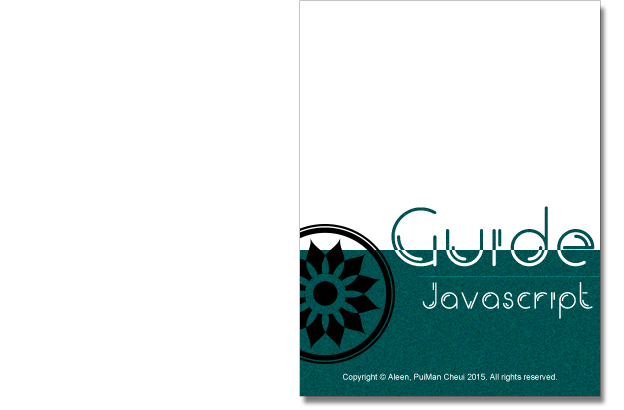

# About
- This is a book which is about the personal guide of JavaScript style, to constraint my coding style. And the guides has combined with [**Airbnb**](https://github.com/airbnb/javascript#types), [**Idiomatic**](https://github.com/rwaldron/idiomatic.js), and so on.
- Continually, I'll write the same other books about **HTML**, **CSS** ,etc.

# Categories
1. [**Types**](./types/types.md)
2. [**References**](./references/references.md)
3. [**Objects**](./objects/objects.md)
4. [**Arrays**](./arrays/arrays.md)
5. [**Destructuring**(解構)](./destructuring/destructuring.md)
6. [**String**](./string/string.md)
7. [**Functions**](./functions/functions.md)
8. [**Arrow Functions**](./arrowFunctions/arrowFunctions.md)

## About me

